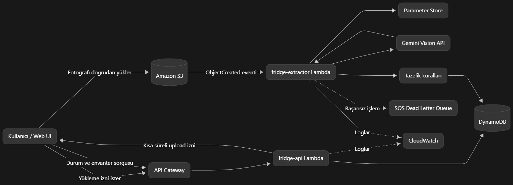
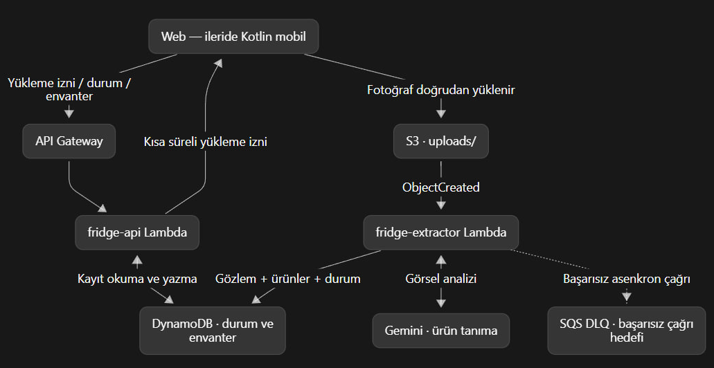

# Arçelik IoT Akıllı Buzdolabı — Görsel Tabanlı Envanter PoC

Bu proje, buzdolabına eklenen gıdaların tek bir fotoğraf üzerinden tanınmasını,
envantere kaydedilmesini ve kategori bazlı **tahmini tazelik tarihinin**
hesaplanmasını sağlayan Faz 1 (MVP/PoC) çözümüdür.

Amaç yalnızca çalışan bir demo üretmek değil; aşağıdaki üç ürün varsayımını
ölçülebilir bir mimariyle doğrulamaktır:

1. Hazır bir görsel dil modeli, özel eğitim olmadan gıda ürünlerini yeterli
   doğrulukta tanıyabilir mi?
2. Kategori, alt kategori ve ambalaj durumuna dayalı tazelik tahmini kullanıcı
   için anlamlı bir sinyal oluşturabilir mi?
3. Akış, AWS üzerinde kontrollü maliyet ve kabul edilebilir gecikmeyle
   işletilebilir mi?

> **Önemli:** Sistemin ürettiği `estimated_freshness_date`, üretici tarafından
> verilen son tüketim tarihi veya tavsiye edilen tüketim tarihi değildir. Bu
> değer, fotoğraf tarihi ve raf ömrü kurallarından türetilen muhafaza edilmiş bir
> tahmindir.

## Projeyi nasıl tasarladık?

Projeyi tasarlarken kullanıcı tarafındaki işlemi mümkün olduğunca basit tutmak
istedik. Kullanıcı yalnızca web arayüzünden bir fotoğraf seçiyor; geri kalan
işlemler arka planda ilerliyor. Fotoğrafı önce bir sunucuya gönderip oradan
tekrar taşımak yerine, kısa süreli ve sınırlandırılmış bir yükleme izniyle
doğrudan Amazon S3'e aktarıyoruz.

Fotoğraf S3'e ulaştığında analiz süreci otomatik olarak başlıyor. Gemini 2.5
Flash fotoğraftaki ürünleri tanımlıyor, ancak tazelik tarihini modele
hesaplatmıyoruz. Bunun yerine modelden aldığımız kategori ve ambalaj bilgilerini
kendi raf ömrü kurallarımızla birleştiriyoruz. Sonuçları da DynamoDB üzerinde
envanter kaydı hâline getiriyoruz.

Bu yapıyı oluştururken özellikle şu noktalara dikkat ettik:

- Kullanıcının mümkün olduğunca az manuel bilgi girmesi
- Görsel analizi sürerken arayüzün beklememesi
- Modelden gelen bilgilerin kontrol edilmeden envantere yazılmaması
- İleride farklı bir görsel analiz servisine geçilebilmesi
- Görsellerin ve API anahtarının güvenli şekilde saklanması
- AWS kaynaklarının gerektiğinde aynı şekilde yeniden kurulabilmesi

## Uçtan uca mimari


*Ayrıntılı görünüm; istemci, AWS servisleri, Gemini entegrasyonu, hata yönetimi
ve Faz 1 kapsam sınırını birlikte gösterir.*

> **Not:** Yukarıdaki üç diyagram, bounding box tabanlı ürün görseli kırpma
> özelliğinden önce çizilmiştir. Yeni akışta ek olarak: Gemini yanıtı `box_2d`
> taşır, `fridge-api` kaynak fotoğraf için presigned GET URL üretir ve tarayıcı
> ürünleri bu kutulara göre kırpar. Diyagramlar bir sonraki güncellemede bu adımı
> da içerecek şekilde yenilenmelidir.

### Akış nasıl çalışır?

1. Web arayüzü seçilen fotoğrafı tarayıcıda en fazla 1024 piksele küçültür ve
   JPEG kalitesini optimize eder.
2. İstemci `POST /v1/uploads` ile kısa süreli bir presigned POST yükleme izni ve
   `upload_id` alır.
3. Görsel, API Gateway veya Lambda üzerinden taşınmadan doğrudan
   `uploads/` önekli S3 alanına yüklenir.
4. `ObjectCreated` olayı `fridge-extractor` Lambda fonksiyonunu tetikler.
5. Görsel Gemini 2.5 Flash'a gönderilir; ürün adı, kategori, adet, ambalaj
   durumu, alan bazlı güven skorları **ve her ürün için sınırlayıcı kutu
   (`box_2d`, 0-1000 normalize `[ymin, xmin, ymax, xmax]`)** alınır.
6. Tazelik motoru, fotoğraf tarihi ile kategori/alt kategori raf ömrü
   kurallarını birleştirir.
7. Gözlem, ürünler (kutularıyla birlikte) ve işlem durumu DynamoDB'ye atomik
   olarak yazılır.
8. Web arayüzü işlem durumunu kısa aralıklarla sorgular; tamamlandığında hem
   güncel envanteri gösterir hem de **her ürünü kutusuna göre kaynak
   fotoğraftan kırpıp ayrı bir görsel olarak** sunar.

> **Ürün görseli kırpma (Faz 1 prototipi):** Kutuya göre kırpma şu an bilinçli
> olarak tarayıcıda yapılıyor — amaç, hazır bir görsel modelinin ürün konumlarını
> yeterli doğrulukta verebildiğini kanıtlamak. `fridge-api`, işlem tamamlandığında
> kaynak fotoğrafın kısa ömürlü presigned GET URL'sini döner (`GET
> /v1/uploads/{id}` → `source_image_url`); tarayıcı bu görseli çekip her kutuyu
> kendi görsel boyutuyla çarparak kırpar. Sonraki fazda bu işlem buluta
> (`fridge-extractor` içinde Pillow ile kırpma → S3 `crops/` önekinde saklama)
> taşınacak; kutular pipeline'dan zaten geçtiği için bu, yerel bir değişiklik
> olacak. Bu görseller ileride mobil uygulamada ürün görseli olarak kullanılacak.

### AWS servisleri üzerinden işlem akışı



*Bu görünüm; web arayüzünden başlayan yükleme ve envanter sorgularının API
Gateway, Lambda, S3, Gemini, tazelik kuralları ve DynamoDB arasında nasıl
ilerlediğini; log ve başarısız işlem yollarıyla birlikte gösterir.*

### Servis ilişkilerinin sade görünümü



*Sade görünüm; yükleme izni, doğrudan S3 aktarımı, görsel analiz, envanter
yazımı ve başarısız asenkron çağrıların DLQ'ya yönlendirilmesini özetler.*

## Faz 1'de neler yaptık?

Faz 1'de önce projenin temel fikrini uçtan uca çalıştırmaya odaklandık:
kullanıcı fotoğrafı yüklesin, ürünler tanınsın ve sonuç envanterde görülsün.
Bu fazda hazırladığımız parçalar şunlar:

| Hazırladığımız parça | Bu projede ne yapıyor? |
|---|---|
| **Web demo arayüzü** | React ve Vite ile geliştirildi. Fotoğraf yükleme, işlem durumunu takip etme ve envanteri görüntüleme/düzeltme/silme işlemlerini içeriyor. |
| **Vision-LLM ile ürün tanıma** | Gemini 2.5 Flash, fotoğraftaki ürünlerin adını, kategorisini, alt kategorisini, ambalaj durumunu, miktarını, confidence score değerlerini ve her ürün için sınırlayıcı kutuyu (`box_2d`) çıkarıyor. |
| **Kutuya göre ürün görseli kırpma** | Gemini'nin döndürdüğü kutular kullanılarak toplu fotoğraftaki her ürün ayrı bir görsele kırpılıp arayüzde tek tek gösteriliyor. Faz 1'de kırpma tarayıcıda yapılıyor (prototip); ileride buluta taşınacak. |
| **Rule-based freshness estimation** | Modelden SKT/TETT üretmesini istemiyoruz. `estimated_freshness_date`, fotoğraf tarihi ile kategori ve ambalaj durumuna göre hazırladığımız raf ömrü kurallarından hesaplanıyor. |
| **Inventory CRUD** | Bulunan ürünler envantere eklenebiliyor (`Create`), listelenebiliyor (`Read`), düzeltilebiliyor veya tüketildi/atıldı olarak işaretlenebiliyor (`Update`) ve silinebiliyor (`Delete`). |
| **Field-level confidence score** | Ürün adı ve kategori için güven değerlerini ayrı tutuyoruz. Güven değeri %70'in altına düşen kayıtları `needs_review` olarak işaretliyoruz. |
| **Serverless AWS altyapısı** | API Gateway, Lambda, S3 ve DynamoDB ile sürekli açık bir sunucu yönetmeden çalışan, PoC ölçeğinde maliyeti kontrol edilebilir bir yapı kurduk. |

## Faz 2 ve sonrasında neler eklenebilir?

Aşağıdaki özellikler mevcut akışın parçası değil; Faz 1 sonuçlarına göre
değerlendirmeyi düşündüğümüz geliştirmelerdir:

| Planlanan geliştirme | Projedeki karşılığı ne olacak? |
|---|---|
| **Android/Kotlin mobil uygulama** | Web demo arayüzündeki fotoğraf yükleme ve envanter işlemlerinin mobil istemciye taşınması. |
| **Authentication & authorization** | Sabit `u_demo` kullanıcısı yerine Amazon Cognito/JWT ile gerçek kullanıcı girişi ve her kullanıcının yalnızca kendi envanterine erişmesi. |
| **OCR desteği** | Ambalaj üzerinde açıkça görülen SKT/TETT bilgisinin OCR ile okunması ve sistemin ürettiği tahmini tarihten ayrı tutulması. |
| **Push notifications** | Tazeliğini kaybetmek üzere olan ürünler için kullanıcıya mobil veya web bildirimi gönderilmesi. |
| **Human-in-the-loop review** | Confidence score düşük olduğunda sonucun otomatik kabul edilmesi yerine kullanıcıya veya operatöre gösterilip onaylanması/düzeltilmesi. Bu düzeltmeler daha sonra model performansını ölçmek için de kullanılabilir. |
| **Workflow orchestration ve analytics** | İşlem adımları çoğalırsa retry ve hata yönetimi için AWS Step Functions; geçmiş envanter hareketlerini analiz etmek için DynamoDB Streams ve bir data lake akışı kullanılması. |

Faz 1'de kimlik doğrulama bulunmaz ve sabit bir demo kullanıcı modeli
kullanılır. Bu nedenle mevcut yapı gerçek son kullanıcı trafiğinden önce
kimlik doğrulama ve kurumsal veri gizliliği kontrolleriyle genişletilmelidir.

## Mevcut durum

Aşağıdaki durum, repodaki kod ve otomatik testler esas alınarak hazırlanmıştır;
canlı AWS ortamının dağıtılmış olduğu anlamına gelmez.

| Alan | Durum | Açıklama |
|---|---|---|
| Çekirdek iş mantığı | Hazır | Taksonomi, çıkarım sözleşmesi, raf ömrü ve tazelik motoru uygulanmış durumda |
| Backend ve veri erişimi | Hazır | Presigned yükleme, çıkarım, durum sorgulama ve envanter CRUD akışları mevcut |
| AWS altyapısı | Kodlandı | S3, Lambda, HTTP API, DynamoDB, SSM, DLQ, log grupları ve bütçe CDK ile tanımlı |
| Web arayüzü | Hazır | Fotoğraf yükleme, durum takibi, envanter görüntüleme/düzeltme/silme akışları mevcut |
| Otomatik doğrulama | Geçiyor | 94 birim ve 24 moto tabanlı entegrasyon testi |
| PoC başarı ölçümü | Bekliyor | 50 etiketli görselle doğruluk, gecikme ve maliyet ölçümü tamamlanmalı |

## Teknik bileşenler

| Katman | Teknoloji | Rolü |
|---|---|---|
| İstemci | React, Vite, TypeScript | Görsel seçimi, tarayıcıda küçültme, yükleme ve envanter yönetimi |
| Kimlik | Amazon Cognito User Pool + API Gateway JWT authorizer | Mobil kimlik doğrulama (PKCE), `sub` bazlı sahiplik |
| API | Amazon API Gateway HTTP API | Yükleme izni, durum, envanter, swipe, değerlendirme, alışveriş, tarif uçları |
| Uygulama | AWS Lambda, Python 3.12, ARM64 | API işlemleri ve asenkron görsel çıkarımı |
| Ham veri | Amazon S3 | Görselleri özel erişimle, 30 günlük yaşam döngüsüyle saklama |
| Yapay zekâ | Gemini 2.5 Flash | Fotoğraftan yapılandırılmış ürün bilgisi çıkarma |
| İş kuralları | Saf Python çekirdeği | Taksonomi doğrulama ve tahmini tazelik hesabı |
| Veri | Amazon DynamoDB | Gözlem, ürün, yükleme durumu ve idempotency kayıtları |
| API anahtarının saklanması | AWS Systems Manager Parameter Store | Gemini anahtarını kodun dışında ve şifreli biçimde saklama |
| Hata yönetimi | Amazon SQS DLQ | Başarısız asenkron çıkarımları 14 gün saklama |
| Gözlemlenebilirlik | Amazon CloudWatch Logs | Lambda loglarını yedi günlük saklama politikasıyla tutma |
| Altyapı | AWS CDK, Python | Kaynakları kodla ve tekrar üretilebilir biçimde tanımlama |

AWS bölgesi `eu-central-1` (Frankfurt) olarak sabitlenmiştir.

## Bu yapıyı neden tercih ettik?

- **Fotoğrafı doğrudan S3'e yükledik.** Görseli API Gateway ve Lambda üzerinden
  geçirmek hem gereksiz veri trafiği oluşturacak hem de dosya boyutu sınırlarını
  yönetmeyi zorlaştıracaktı. Bu yüzden dosya türünü ve boyutunu sınırlayan
  presigned POST yöntemini kullandık.
- **Görsel analizini arka planda çalıştırdık.** Modelin yanıt süresi her zaman
  aynı olmayabileceği için kullanıcıyı açık bir HTTP isteğinde bekletmek
  istemedik. Fotoğraf yüklendikten sonra işlem devam ediyor, arayüz ise belirli
  aralıklarla sonucu kontrol ediyor.
- **Modelin ürettiği her bilgiyi doğrudan kabul etmedik.** Kategori ve alt
  kategori seçeneklerini önceden belirledik. Model bu listelerden seçim yapıyor,
  gelen sonuç uygulama tarafında bir kez daha kontrol ediliyor.
- **Tazelik tarihini yapay zekâya bırakmadık.** Model yalnızca fotoğrafta ne
  gördüğünü söylüyor. Tahmini tarih, bizim hazırladığımız raf ömrü tablosu ve
  Python kodu üzerinden hesaplanıyor. Böylece sonuçların nasıl oluştuğunu
  açıklayabiliyor ve aynı girdide aynı hesabı yapabiliyoruz.
- **Güven skorunu tek değer olarak tutmadık.** Ürün adı doğru görünürken
  kategori düşük güvenli olabilir. Bu nedenle iki alanın güvenini ayrı saklıyor,
  düşük güvenli sonuçları arayüzde gözden geçirilecek şekilde işaretliyoruz.
- **Aynı fotoğrafın iki kez işlenmesini önledik.** S3 bazı olayları birden fazla
  kez iletebildiği için her görsel için benzersiz bir işlem anahtarı oluşturduk.
  Böylece aynı ürünlerin envantere tekrar tekrar eklenmesini engelliyoruz.
- **Kayıtların yarım kalmamasını hedefledik.** Gözlem, bulunan ürünler ve yükleme
  durumu DynamoDB'ye birlikte yazılıyor. İşlemin bir bölümü başarısız olduğunda
  eksik bir envanter kaydı oluşmuyor.
- **Gemini'ye doğrudan bağımlı kalmadık.** Görsel analiz bölümünü
  `VisionProvider` adını verdiğimiz bir katmanın arkasına aldık. İleride başka
  bir bulut servisi veya cihaz üzerinde çalışan bir model denenirse ana iş
  kurallarını baştan yazmamız gerekmeyecek.

## Güvenlik ve maliyet tarafında nelere dikkat ettik?

- S3 alanını dışarıya kapattık ve ham görselleri şifreli saklayacak şekilde
  yapılandırdık.
- Gemini API anahtarını kodun ya da Lambda ayarlarının içine yazmadık. Anahtarı
  SSM Parameter Store üzerinde şifreli saklayıp yalnızca ihtiyaç anında okuyoruz.
- Görsel içeriğini, modelin tam yanıtını ve API anahtarını loglara yazmıyoruz.
- Her Lambda fonksiyonuna yalnızca ihtiyaç duyduğu AWS kaynakları için izin
  veriyoruz.
- Faz 1 için gerekmeyen VPC ve NAT Gateway kullanımından kaçındık; böylece
  gereksiz sabit maliyet oluşturmuyoruz.
- Aynı anda çalışabilecek analiz sayısını sınırladık. Başarısız işlemleri daha
  sonra inceleyebilmek için ayrı bir hata kuyruğuna gönderiyoruz.
- Beklenmeyen harcamaları erken fark edebilmek için aylık 5 USD bütçeye bağlı
  %80 ve %100 uyarıları tanımladık.
- Görseller Gemini servisine gönderildiği için Faz 1 çalışmalarını yalnızca
  ekip tarafından hazırlanan test verileriyle yürütüyoruz. Gerçek kullanıcı
  verisinden önce ayrıca veri gizliliği değerlendirmesi yapılması gerekiyor.

> Ücretsiz katman kullanımı garanti değildir; gerçek maliyet AWS hesabının
> koşullarına, trafik miktarına ve harici model kotasına bağlıdır.

## Mobil cloud mimarisi (Faz 2)

Native Android (Kotlin/Compose) mobil uygulamanın SRS'inde tanımlanan
özellikleri karşılamak için cloud mimarisi genişletildi. Ayrıntılı gereksinimler
için bkz. mobil SRS.

**Kimlik doğrulama.** Amazon Cognito User Pool (public client, Authorization
Code + PKCE; mobilde secret tutulmaz). API Gateway JWT authorizer token'ı
doğrular; kullanıcı kimliği **yalnızca** doğrulanmış JWT `sub` claim'inden alınır
(`x-user-id` header'ına üretimde güvenilmez). Yerel geliştirme/test için
`AUTH_MODE=dev` header fallback'i vardır.

**Buzdolabı (hane) modeli.** Kullanıcı kayıt olurken Ad-Soyad + önceden
provision edilmiş bir **buzdolabı ID**'si girer (`ARC-FRIDGE-001..003`, CDK ile
tohumlanır ve `SeedFridgeIds` çıktısında listelenir). Veri buzdolabı bazında
partition'lanır (`FRIDGE#{fridge_id}`): aynı dolaba kayıtlı kullanıcılar aynı
envanteri, alışveriş listesini ve önerileri paylaşır. Profil, cihaz ve tercih
kullanıcıya özeldir (`USER#{sub}`).

**Yeni veri varlıkları** (tek tablo `fridge-main`): kullanıcı profili, swipe
aksiyonu (idempotent, `client_action_id`), tazelik değerlendirmesi (sistem
tahminini ezmez), replacement candidate, alışveriş kalemi, cihaz kaydı ve
hatırlatma. Tarif veri seti Lambda paketine gömülü sürümlü JSON'dur
(`core/recipes.json`), skor deterministiktir.

## API özeti

Tüm `/v1` rotaları JWT ister. Durum değerleri: `PENDING`, `PROCESSING`,
`COMPLETED`, `FAILED`.

| Metot | Yol | Amaç |
|---|---|---|
| `GET` / `PUT` | `/v1/users/me` | Profili okur / oluşturur-günceller (Ad-Soyad + fridge ID doğrulaması) |
| `PUT` | `/v1/users/me/notification-preferences` | Bildirim tercihlerini günceller |
| `POST` / `DELETE` | `/v1/devices[/{installation_id}]` | Push cihaz kaydı (gönderim sonraki faz) |
| `POST` | `/v1/uploads` | Presigned POST ve `upload_id` üretir |
| `GET` | `/v1/uploads/{upload_id}` | İşlem durumunu, ürünleri (kutularıyla) ve kaynak görselin presigned GET URL'sini döndürür |
| `GET` | `/v1/items` | Aktif envanteri etkin tazelik sırasıyla listeler |
| `PATCH` / `DELETE` | `/v1/items/{item_id}` | Ürünü düzeltir / siler |
| `POST` | `/v1/items/{item_id}/actions` | Swipe aksiyonu (tükettim/attım/kontrol), idempotent |
| `POST` | `/v1/item-actions/{action_id}/undo` | Swipe'ı geri alır |
| `POST` | `/v1/items/{item_id}/freshness-assessments` | Kullanıcı tazelik değerlendirmesi |
| `PUT` / `DELETE` | `/v1/items/{item_id}/reminder` | Bireysel hatırlatma (opt-in) |
| `GET` | `/v1/review-queue` | Kontrol kuyruğu (BR-003/BR-004 önceliğiyle) |
| `GET` | `/v1/shopping-lists/current` | Alışveriş listesi (aktif + tamamlanan) |
| `POST`/`PATCH`/`DELETE` | `/v1/shopping-lists/current/items[/{id}]` | Alışveriş kalemi ekle/düzenle/sil |
| `GET` | `/v1/replacement-candidates` | Bekleyen yeniden alma önerileri |
| `POST` | `/v1/replacement-candidates/{id}/accept` \| `/dismiss` | Öneriyi listeye ekle / reddet |
| `GET` | `/v1/recipes/recommendations` | Stok uyumlu deterministik tarif önerileri |

## Repo yapısı

```text
src/
  core/          AWS bağımsız iş kuralları, taksonomi ve tazelik motoru
  adapters/      Gemini ve DynamoDB adaptörleri
  handlers/      Lambda giriş noktaları ve HTTP yönlendirme
infra/           AWS CDK stack'i ve Lambda paketleme betiği
web/             React/Vite test arayüzü
tests/
  unit/          AWS erişimi gerektirmeyen birim testleri
  integration/   moto ile sahte AWS servisleri kullanan entegrasyon testleri
fixtures/        Etiketli doğrulama veri setinin tanımı
docs/            Mimari görseller ve raf ömrü kaynak verileri
```

## Yerel kurulum ve doğrulama

Gereksinimler:

- Python 3.12+
- Node.js 20+
- AWS CLI ve AWS CDK CLI (altyapı işlemleri için)

### Python ortamı

Windows PowerShell:

```powershell
python -m venv .venv
.\.venv\Scripts\Activate.ps1
python -m pip install -r requirements-dev.txt -r requirements.txt
```

Kalite kontrolleri:

```powershell
ruff check .
ruff format --check .
pytest tests/unit
pytest tests/integration -m integration
```

Bu testler gerçek AWS kaynaklarına bağlanmaz; entegrasyon testleri AWS
servislerini `moto` ile yerelde taklit eder.

### Web arayüzü

```powershell
Set-Location web
npm install
npm run dev
```

Arayüz varsayılan olarak `http://localhost:5173` adresinde açılır. API adresi
arayüzdeki bağlantı panelinden veya `web/.env.local` içindeki `VITE_API_URL`
değeriyle verilebilir.

### AWS altyapısı

Önce Gemini anahtarını repoya yazmadan SSM'e ekleyin:

```powershell
aws ssm put-parameter --name /smartfridge/dev/gemini-api-key --type SecureString --value "ANAHTAR" --region eu-central-1
```

Ardından Lambda paketlerini hazırlayıp CDK çıktısını doğrulayın:

```powershell
python infra/scripts/build_lambda_packages.py
Set-Location infra
python -m pip install -r requirements.txt
cdk synth -c budget_alert_email=ekip@ornek.com
```

Canlı kaynak oluşturacak `cdk deploy` adımı öncesinde AWS hesabı, bölge,
bütçe e-posta adresi ve kurumsal onayların doğrulanması gerekir.

## Başarı kriterleri ve sonraki adımlar

Faz 1'in tamamlanması için 50 etiketli test görseli üzerinde en az sekiz gıda
kategorisini kapsayan ölçüm seti hazırlanmalıdır. Ölçüm raporu şu dört sonucu
birlikte sunmalıdır:

1. Ürün adı tanıma doğruluğu
2. Kategori doğruluğu
3. Uçtan uca işlem gecikmesi
4. Görsel başına ve aylık tahmini maliyet

Bu ölçüm tamamlanmadan çözüm “üretime hazır” olarak değerlendirilmemelidir.

## Ayrıntılı dokümantasyon

- [AWS altyapısı ve deploy adımları](infra/README.md)
- [Web arayüzü rehberi](web/README.md)
- [Doğrulama görselleri ve etiket formatı](fixtures/README.md)
