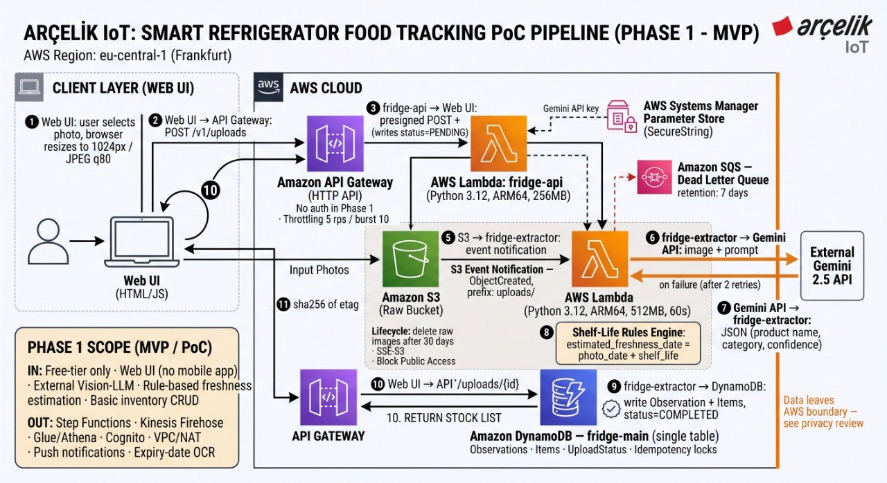

# infra/ — AWS Altyapısı (CDK)

Tüm altyapı Python ile yazılmış tek bir AWS CDK stack'idir
([`stacks/fridge_stack.py`](stacks/fridge_stack.py)). `cdk deploy` ile kurulur,
`cdk destroy` ile tamamen silinir. Bölge sabittir: **eu-central-1 (Frankfurt)**.



## Stack ne kuruyor

| # | Kaynak | Notlar |
|---|---|---|
| 1 | CloudWatch Log Grupları (×3) | Lambda'lar + API Gateway erişim logu, retention 7 gün |
| 2 | DynamoDB `fridge-main` | Provisioned 5/5, GSI1, TTL `expires_at`, Streams açık |
| 3 | SQS `fridge-extractor-dlq` | Başarısız çıkarımlar için ölü mektup kuyruğu, 14 gün |
| 4 | SSM parametre referansı | Gemini anahtarı; değer **elle** oluşturulur (aşağıda) |
| 5 | Lambda `fridge-api` / `fridge-extractor` | arm64, Python 3.12, VPC yok |
| 6 | S3 `fridge-raw-{hesap}` | Public access kapalı, SSE-S3, CORS, 30 gün lifecycle, olay bildirimi |
| 6.5 | Cognito User Pool + 2 client + Hosted UI domain | Mobil client (deep-link) + web test client (localhost); JWT authorizer bu havuzu kullanır |
| 7 | HTTP API `fridge-api-gw` | 24 rota, tümü JWT authorizer arkasında, throttling 5 rps / burst 10, CORS kısıtlı |
| 8 | Budget 5 USD | %80 ve %100 eşiklerinde e-posta alarmı |
| 9 | IAM rolleri (×2) | Kaynak bazlı, wildcard yok |
| 10 | Fridge registry seed | `AwsCustomResource` ile 3 prototip buzdolabı ID'si (`ARC-FRIDGE-001..003`) her deploy'da yazılır |

Deploy sonunda şu çıktılar verilir:

| Çıktı | Ne işe yarar |
|---|---|
| `ApiUrl` | Web/mobil `baseUrl` — API Gateway adresi |
| `BucketName`, `TableName` | Referans/tanı amaçlı |
| `UserPoolId` | Mobil (Kotlin) tarafın Cognito SDK yapılandırması için |
| `UserPoolClientId` | **Mobil** uygulamanın Cognito client ID'si (deep-link callback) |
| `WebTestClientId` | **Web test arayüzünün** Cognito client ID'si (localhost callback) — mobil client'tan farklı |
| `CognitoDomain` | Hosted UI taban URL'si (`/oauth2/authorize`, `/oauth2/token`, `/logout`) |
| `SeedFridgeIds` | Kayıtta kullanılabilecek geçerli buzdolabı ID'leri |

> **Kimlik doğrulama zorunlu.** `fridge-api` Lambda'sı `AUTH_MODE=jwt` ile
> çalışır: kimlik yalnızca API Gateway JWT authorizer'ın doğruladığı Cognito
> `id_token`'ın `sub` claim'inden gelir. Deploy edilmiş bir stack'e karşı
> `x-user-id` header'ı işe yaramaz — önce Cognito'da bir kullanıcı
> oluşturup (Hosted UI üzerinden kaydolarak) giriş yapman gerekir.

## Gereksinimler

- Node 20+ ve AWS CDK CLI (`npm i -g aws-cdk`)
- Python 3.12+ ve `pip install -r requirements.txt`
- AWS kimlik profili (`~/.aws/credentials` + `~/.aws/config`, region `eu-central-1`)
- IAM kullanıcısına deploy izinleri; Budget kaynağı için faturalama erişimi

> **Not:** CDK CLI, `cdk.json` içindeki `python app.py` komutunu çalıştırır.
> `aws-cdk-lib`'in `cdk` komutunu çalıştıran Python ortamında kurulu olması
> gerekir (sanal ortam kullanıyorsan `requirements.txt`'i o ortama kur).

## Deploy adımları

### 1. Konsolda, deploy'dan önce

**a. Faturalama erişimi** (yalnızca ilk kez): Budget kaynağı, IAM kullanıcısının
faturalama verisine erişimini gerektirir. Root kullanıcıyla:
`Account → IAM User and Role Access to Billing Information → Activate`.

**b. Gemini anahtarını Parameter Store'a yaz.** SecureString CloudFormation ile
oluşturulamaz (değer şifresiz olarak stack state'ine düşerdi); bu yüzden elle:

```bash
aws ssm put-parameter \
  --name /smartfridge/dev/gemini-api-key \
  --type SecureString \
  --value "GEMINI_ANAHTARIN" \
  --region eu-central-1
```

### 2. Lambda paketlerini derle

Docker gerektirmez; ARM64 / Python 3.12 wheel'lerini kilit dosyasından indirir.

```bash
python scripts/build_lambda_packages.py
```

Bu adım `infra/build/fridge-api` ve `infra/build/fridge-extractor` klasörlerini
üretir. Bu klasörler versiyonlanmaz (`.gitignore`); stack bunlar yoksa açık bir
hata ile durur.

### 3. Bootstrap ve deploy

```bash
cdk bootstrap
cdk deploy -c budget_alert_email=ekip@ornek.com
```

`budget_alert_email` her `synth`/`deploy`'da verilmelidir; kişisel adres git
geçmişine girmesin diye `cdk.json`'a gömülmemiştir.

### 4. Konsolda, deploy'dan sonra — CloudWatch alarmları

Log grupları stack'te tanımlıdır; alarmlar konsoldan kurulur. Önce bir SNS
konusu (`smartfridge-alarms`) oluşturup e-posta aboneliğini onayla, sonra şu
alarmları ekle (Period 5 dk, eksik veri = "iyi/breaching değil"):

| Metrik | Boyut | İstatistik | Eşik |
|---|---|---|---|
| Lambda Errors | `fridge-extractor` | Sum | > 5 |
| Lambda Throttles | `fridge-extractor` | Sum | > 0 |
| Lambda Duration | `fridge-extractor` | p95 | > 30000 ms |
| SQS ApproximateNumberOfMessagesVisible | `fridge-extractor-dlq` | Maximum | > 0 |

En kritik olan sonuncusudur: DLQ'da mesaj varsa iş kaybı var demektir.

## Web arayüzü yapılandırması

Deploy çıktılarından `web/.env` doldurulur:

```bash
cat > ../web/.env <<EOF
VITE_API_URL=<ApiUrl>
VITE_COGNITO_DOMAIN=<CognitoDomain>
VITE_COGNITO_CLIENT_ID=<WebTestClientId>
EOF
cd ../web && npm install && npm run dev   # http://localhost:5173
```

`WebTestClientId` kullan — `UserPoolClientId` (mobil) DEĞİL; ikisinin callback
allowlist'i farklıdır (web: `http://localhost:5173/auth/callback`, mobil:
`arcelikfridge://auth`), biri diğerinin yerine kullanılamaz.

## Uçtan uca doğrulama

1. **Kayıt ol.** `http://localhost:5173` açılınca ayarlar zaten `.env`'den
   dolu gelir (veya elle gir). "Cognito ile Giriş Yap / Kaydol" butonuna bas;
   Hosted UI'da yeni bir e-posta/şifre ile kaydol (e-posta doğrulama kodu
   gelir — Cognito varsayılan e-posta gönderimini kullanır, sandbox modunda
   yalnızca doğrulanmış adreslere gider, bkz. aşağıdaki not).
2. **Profil oluştur.** Girişten sonra arayüz Ad-Soyad + buzdolabı ID'si
   ister; `SeedFridgeIds` çıktısındaki ID'lerden birini gir (örn.
   `ARC-FRIDGE-001`).
3. **Fotoğraf yükle.** Bir gıda fotoğrafı yükle; `/aws/lambda/fridge-extractor`
   log grubunda `extraction_completed` satırını gör, envanterde ürünün
   belirmesini bekle.
4. **Yeni özellikleri dene.** "Kontrol" sekmesinde swipe aksiyonlarını
   (Tükettim/Attım/Kontrol Et), "Listem" sekmesinde önerilen alışveriş
   kalemlerini, "Tarifler" sekmesinde stok uyumlu önerileri gör.

> **Cognito e-posta sandbox'ı.** Yeni bir Cognito User Pool varsayılan olarak
> SES sandbox modunda gönderim yapar — yalnızca SES konsolunda doğrulanmış
> e-posta adreslerine doğrulama kodu gider. Test için kendi e-postanı SES'te
> doğrula (`aws ses verify-email-identity --email-address SENIN@EMAIL.COM
> --region eu-central-1`) ya da Cognito konsolundan kullanıcıyı manuel
> `CONFIRMED` durumuna al.

## Silme

```bash
cdk destroy
```

Tüm kaynaklar `removalPolicy=DESTROY` ile tanımlıdır (Cognito User Pool dahil);
stack silindiğinde geride kaynak kalmaz. SSM parametresi elle oluşturulduğu
için elle silinir:

```bash
aws ssm delete-parameter --name /smartfridge/dev/gemini-api-key --region eu-central-1
```

## Tasarım notu — dairesel bağımlılık

S3 olay bildirimi extractor Lambda'ya bağımlıdır. Extractor'ın IAM politikası da
bucket'a erişir; ancak bu erişim `grant_read/grant_put` ile verilirse policy'ye
bucket'a bir `Fn::GetAtt` referansı gömülür ve `RawBucket → ExtractorFunction →
policy → RawBucket` döngüsü oluşur. Bu döngü `cdk synth` sırasında görünmez,
yalnızca CloudFormation changeset aşamasında "Circular dependency" hatası verir.
Bunu önlemek için bucket ARN'i hesap kimliğinden elle kurulur ve IAM statement'ı
`add_to_role_policy` ile bucket kaynağına referans vermeden yazılır.
